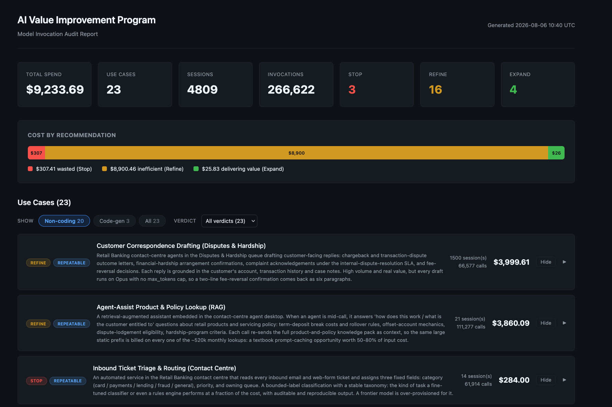
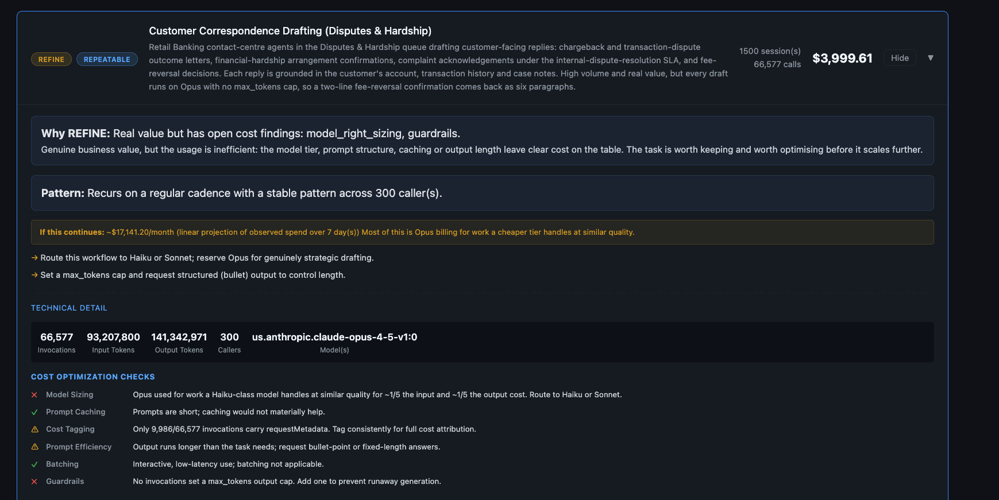

# AI Value Assessment

AI Value Assessment reads your AI usage logs and produces a report that, for
each business use case in those logs, recommends whether to **STOP**, **REFINE**,
or **EXPAND** it, and labels it as a one-off experiment or a recurring workflow.

It supports two log source formats:
- **Bedrock Model Invocation Logs** (default): captures every Bedrock call
  regardless of source (Claude Code, Codex, Amazon Q Developer, LibreChat, or a
  plain SDK script).
- **OpenTelemetry (OTLP) JSON**: captures telemetry from tools like Claude Code
  and Claude Cowork via an OpenTelemetry Collector writing to S3.

It classifies the business task behind each call, not the tool that made it.

There are two ways to run it: a CloudFormation stack that runs the audit as a
CodeBuild job inside your account (recommended), or a local CLI.

## Deploy with CloudFormation (recommended)

The audit runs as a CodeBuild job inside your account and writes the report to
an S3 bucket. Nothing leaves AWS.

In the CloudFormation console, create a stack and upload
[`cloudformation/deploy.yaml`](cloudformation/deploy.yaml) as the template.

1. Switch to the same region as your Model Invocation Logs bucket. Model access,
   IAM, and logging config are all regional, and a cross-region deploy fails
   pre-flight checks.
2. Set **SourceBucketName** to your log bucket. Optionally set
   **DestinationBucketName**, or leave it blank to have one generated.
3. Optionally set **ReportReaderPrincipalArn** to the single IAM identity that
   may read the report. The report contains real prompt and response excerpts.
   Left blank, any principal in the account can read it. Public access is always
   blocked.
4. Acknowledge the IAM-resources checkbox and create the stack. The audit starts
   when the stack finishes deploying.
5. The report lands in the destination bucket (`DestinationBucketNameOutput`)
   when the CodeBuild project (`AuditProjectConsoleUrl`) finishes.

The stack creates a CodeBuild project, an IAM role scoped to
[`docs/iam-policy.json`](docs/iam-policy.json) plus write to the output bucket,
and the destination S3 bucket (encrypted, public-access blocked, HTTPS-only).
To deploy you need only `codebuild:StartBuild`, `codebuild:BatchGetBuilds`, and
read on the output bucket. The CodeBuild role holds the log-bucket read and
Bedrock invoke, not your own identity.

## Local CLI

The `aiva` package also runs on your machine. The audit runs as a local process
using your AWS credentials, and both the working data and the report land on
local disk.

```bash
git clone https://github.com/aws-samples/sample-ai-value-assessment.git
cd sample-ai-value-assessment
uv venv && source .venv/bin/activate
uv pip install -e .

export AWS_PROFILE=your-profile

aiva audit \
  --bucket <your-model-invocation-logs-bucket> \
  --prefix bedrock-logs \
  --region <your-region> \
  --days 7 \
  --output report
```

This writes `report.html`, `report.md`, and `report.json`. These contain real
prompt and response excerpts. Treat them as sensitive: do not commit or share
them externally. Pass `--db path/to/audit.db` to keep the working store and
resume an interrupted run.

## Using OTLP sources (Claude Code, Cowork, or any OTLP exporter)

If your OTLP telemetry from Claude Code, Claude Cowork, or any other
OTLP-compatible tool is already landing in S3 as JSON files, you can audit it
directly with `--source otlp`.

AIVA expects **OTLP-JSON format** in S3 (the format produced by the OTEL
Collector's `awss3` exporter with `marshaler: otlp_json`). How you get the data
into S3 is up to you. For configuration references:

- **Claude Code / Agent SDK:**
  [Observability docs](https://code.claude.com/docs/en/agent-sdk/observability)
- **Claude Cowork:**
  [Monitoring with OpenTelemetry](https://support.claude.com/en/articles/14477985-monitor-claude-cowork-activity-with-opentelemetry)

For richer classification (prompts and tool details in the report), ensure
`OTEL_LOG_USER_PROMPTS=1` and `OTEL_LOG_TOOL_DETAILS=1` are set on your Claude
Code sessions. Without these, classification still works from tool names and
session patterns, but with less detail.

```bash
aiva audit \
  --bucket your-telemetry-bucket \
  --prefix otel-logs \
  --source otlp \
  --region us-west-2 \
  --days 7 \
  --output report
```

For CloudFormation, set the **SourceFormat** parameter to `otlp` and point
**SourceBucketPrefix** at your OTLP prefix.

**Cost estimate note:** OTLP logs do not carry authoritative billing data. Cost
figures in the report are estimated from token counts and published model
pricing. They do not reflect negotiated rates, provisioned throughput, or batch
discounts.

## Example output

*Example output of a synthetic dataset Financial Services customer*





## Reading the report

Each use case carries one recommendation:

- **STOP**: no identifiable task, or work that does not need AI.
- **REFINE**: real value but inefficient (wrong model tier, no caching, bloated prompts).
- **EXPAND**: clear value, efficient, worth scaling.

A separate axis labels each use case **experimental** or **repeatable**. A
repeatable use case running outside sanctioned channels is shadow AI worth
surfacing to your platform or security team.

Cost-optimisation checks (model right-sizing, caching, tagging, output
guardrails) are shown per use case. Cost and monthly projection are computed in
code, not by the model.

Classification is semantic. Treat each recommendation as a starting point for
human review, not automated action.

**Privacy note:** Example tasks shown per use case are model-generated
paraphrases, not verbatim quotes from logs. The model is instructed to
de-identify (remove names, project names, customer names), but this is
best-effort. Review the report before sharing it outside your immediate team.

## How it works


The audit runs in three passes over the logs:

```
S3 logs -> read + normalise -> group into sessions -> Pass 1 -> Pass 2a -> Pass 2b -> report
```

1. **Describe** each session's underlying business task, looking through the
   tool to the real work.
2. **Cluster** activities into distinct use cases by meaning.
3. **Assess** each use case: STOP/REFINE/EXPAND, experimental/repeatable, and
   cost checks.

## Costs

The audit calls Bedrock a handful of times (roughly one classification call per
session plus a couple of rollup calls) using a small model. The expensive
Bedrock usage is your existing logs; the tool only reads and summarises them.

The table below is illustrative, not a quote. Model Invocation Logging writes
one object per Bedrock call, and cost scales with the number of distinct
sessions, not raw invocation count. Rates are the default classification model,
Sonnet 4.6, at $3.00 per million input tokens and $15.00 per million output.

| Log volume (1 week) | Objects / invocations | Distinct sessions | Approx cost to run |
|---------------------|-----------------------|-------------------|--------------------|
| Small team          | ~1,000                | ~20               | a few cents        |
| Department          | ~20,000               | ~400              | ~$1-3              |
| Org-wide            | ~200,000              | ~4,000            | ~$20-40            |

The middle row is close to a real one-week run measured during development.
Actual cost depends on prompt sizes and how many sessions your logs contain,
so treat these as order-of-magnitude.

## Cleanup

CloudFormation deploy: delete the stack in the CloudFormation console (or
`aws cloudformation delete-stack --stack-name <name>`). This removes the
CodeBuild project and IAM role. If you let CloudFormation generate the
destination bucket, empty it first, then it is removed with the stack; a bucket
you named yourself is left in place. There are no other standing resources.

Local CLI: delete the generated `report.*` files and any `--db` store, and
remove the virtualenv.

## Disclaimer

This is sample code, provided as-is, for demonstration purposes only. It is not
an AWS-supported production tool. Review the IAM policy in
`docs/iam-policy.json` and the code itself before running it against any
account, and test in a non-production environment first.

## Security

See [CONTRIBUTING](CONTRIBUTING.md#security-issue-notifications) for more information.

## License

Licensed under the MIT-0 License. See the `LICENSE` file.
